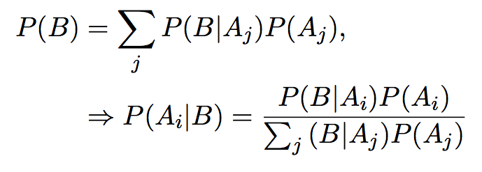

### Question 1 ###

**10 points**

1. Use GitHub to turn in the first four homework assignments. Make sure the teacher (couthcommander) and TA (sarahlotspeich) are collaborators. (5 points)

1. Commit each assignment individually.  This means your repository should have at least four commits. (5 points)

```
The files have been pushed to my GitHub repository and shared with Sarah and Cole.
```

### Question 2 ###

**10 points**

Use \LaTeX to create the following expressions.

1. Hint: `\Rightarrow` (4 points)

Here is the equation from the prompt.



Here is the equation I typeset in Latex.
```
\begin{align*}
\begin{aligned}
P(B) &=\sum_{j} P\left(B \mid A_{j}\right) P\left(A_{j}\right), \\
& \Rightarrow P\left(A_{i} \mid B\right)=
\frac{P\left(B \mid A_{i}\right)
P\left(A_{i}\right)}{\sum_{j}\left(B \mid A_{j}\right)
P\left(A_{j}\right)}
\end{aligned}
\end{align*}
```
\begin{align*}
\begin{aligned}
P(B) &=\sum_{j} P\left(B \mid A_{j}\right) P\left(A_{j}\right), \\
& \Rightarrow P\left(A_{i} \mid B\right)=\frac{P\left(B \mid A_{i}\right) P\left(A_{i}\right)}{\sum_{j}\left(B \mid A_{j}\right) P\left(A_{j}\right)}
\end{aligned}
\end{align*}

1. Hint: `\zeta` (3 points)

Here is the equation from the prompt.


Here is the equation I typeset in Latex.
```
\begin{align*}
\hat{f}(\zeta)=\int_{-\infty}^{\infty} f(x) e^{-2 \pi i x \zeta} d x
\end{align*}
```
\begin{align*}
\hat{f}(\zeta)=\int_{-\infty}^{\infty} f(x) e^{-2 \pi i x \zeta} d x
\end{align*}


1. Hint: `\partial` (3 points)

Here is the equation from the prompt.


Here is the equation I typeset in Latex.
```
\begin{align*}
\mathbf{J}=\frac{d \mathbf{f}}{d \mathbf{x}}=
\left[\frac{\partial \mathbf{f}}{\partial x_{1}}
\ldots \frac{\partial \mathbf{f}}{\partial x_{n}}\right] =
\left[\begin{array}{ccc}
\frac{\partial f_{1}}{\partial x_{1}} & \cdots & \frac{\partial f_{1}}{\partial x_{n}} \\
\vdots & \ddots & \vdots \\
\frac{\partial f_{m}}{\partial x_{1}} & \cdots & \frac{\partial f_{m}}{\partial x_{n}}
\end{array}\right]
\end{align*}
```
\begin{align*}
\mathbf{J}=\frac{d \mathbf{f}}{d \mathbf{x}}=\left[\frac{\partial \mathbf{f}}{\partial x_{1}} \ldots \frac{\partial \mathbf{f}}{\partial x_{n}}\right] = 
\left[\begin{array}{ccc}
\frac{\partial f_{1}}{\partial x_{1}} & \cdots & \frac{\partial f_{1}}{\partial x_{n}} \\
\vdots & \ddots & \vdots \\
\frac{\partial f_{m}}{\partial x_{1}} & \cdots & \frac{\partial f_{m}}{\partial x_{n}}
\end{array}\right]
\end{align*}
    

